# Readfolio: Personal Online Book Tracker

**Live Site**: [https://readfolio-1c0fe0bd7ac4.herokuapp.com/](https://readfolio-1c0fe0bd7ac4.herokuapp.com/)  
**Source Code**: [https://github.com/PaulinaD-CodeIns/readfolio](https://github.com/PaulinaD-CodeIns/readfolio)

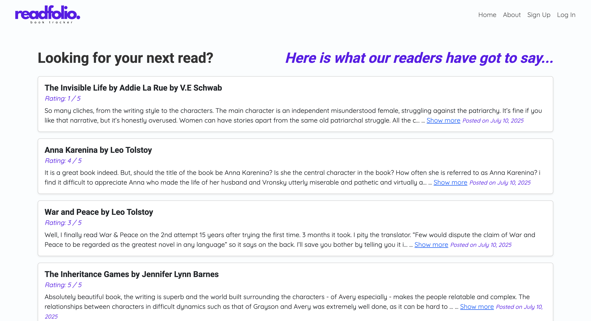
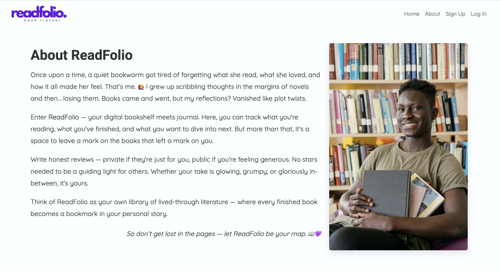
---

## Table of Contents

1. [Overview](#overview)  
2. [UX Goals](#ux-goals)  
3. [Target Audience](#target-audience)  
4. [Visual Design](#visual-design)  
5. [Key Features](#key-features)  
6. [How It Works](#how-it-works)  
7. [Technology Stack](#technology-stack)  
8. [Files and Structure](#files-and-structure)
9. [Models](#models)  
10. [Testing](#testing)  
11. [Deployment](#deployment)  
12. [Credits](#credits)  
13. [Contact](#contact)  

---

## Overview

> "Where your books come alive."

ReadFolio is a full-stack Django web app designed to offer readers a clean, user-centric space to track their personal reading progress, reflect on books, and optionally share their reviews with others. It was developed using Agile methodology, following a structured UX process, with clear user stories and planning boards.

The application allows users to:

- Add books with metadata such as title, author, and reading status  
- Track reading stages (To Read, Reading, Finished)  
- Write private or public reviews for completed books  
- View public reviews shared by other users  

Unlike cluttered or overly social reading platforms, ReadFolio prioritizes a calm and focused user experience rooted in utility, privacy, and simplicity.

---

## UX Goals

The UX design focused on clarity, accessibility, and personalized interaction:

- **Intuitive Layout**: Responsive navbar adapts based on user login state for easy navigation  
- **Minimal Distraction**: Clean layout and content-centered pages aid concentration  
- **User Feedback**: Bootstrap alert messages appear on key actions  
- **Reading Flow Alignment**: Books are grouped by reading status (To Read, Reading, Finished)  
- **Wireframes & User Stories**: Created via tools like Canva; tracked in GitHub Projects. Did not do many as relied mostly on Bootstrap for basic overall styling. 
- **Accessibility**: Semantic HTML, alt tags, contrast, and scalable fonts meet WCAG 2.1 standards  

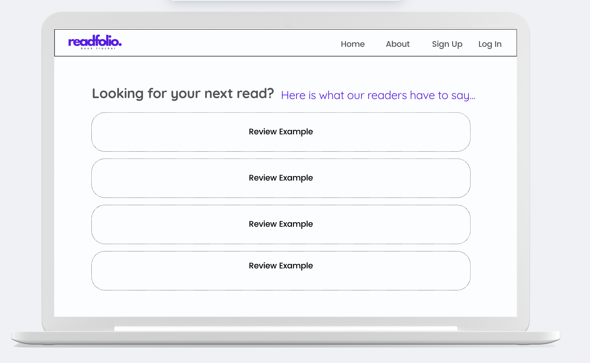
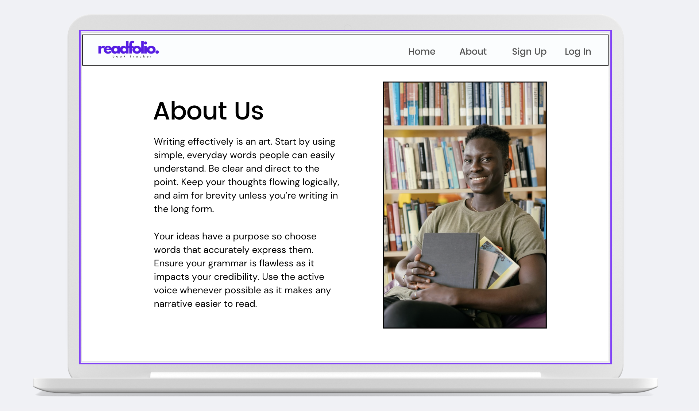

---

## Target Audience

ReadFolio caters to:

- **Avid Readers** wanting to track progress  
- **Casual Bookworms** preserving reading memories  
- **Book Club Members** seeking a distraction-free review space  
- **Reflective Journalers** storing private notes  
- **Minimalists** preferring clean, functional interfaces  

---

## Visual Design

### Fonts and Typography

- **Fonts**: Google Fonts – 'Quicksand' for headings, 'Roboto' for body text  

### Colours and Branding

- **Background**: Off-white `#fbfdfe` for low eye strain  
- **Text**: Standard black `#000000`  
- **Accent**: Violet `#5e17eb` used on buttons and hover elements  

Purple symbolizes **creativity, wisdom, and mystery** — fitting for a book journal.

### Logo

- Created in Canva using a generic book icon  
- Custom coloring and minimal design reflect personal journaling  

### Overall Tone

- Friendly and clean, avoiding dark literary clichés  
- Optimized for openness, calm, and usability  

---

## Key Features

### Book Management (CRUD)

- **Create**: Add books with title, author, and status  
- **Read**: View books in personal dashboard 
- **Update**: Edit book info and progress  
- **Delete**: Remove books (confirmation required)  

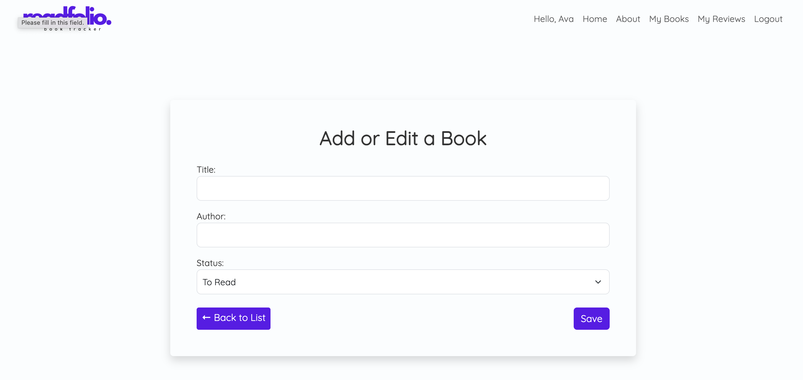
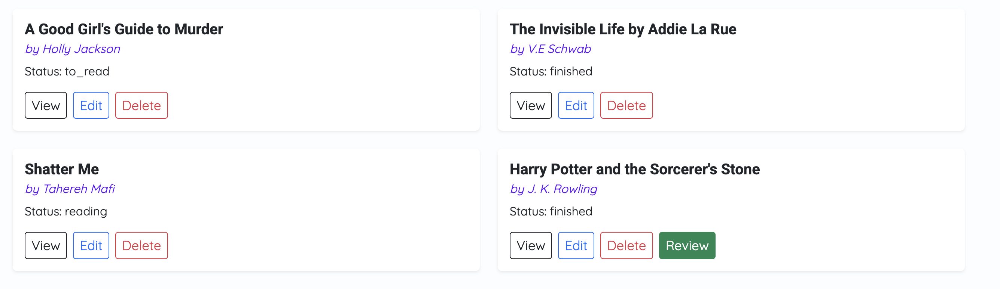
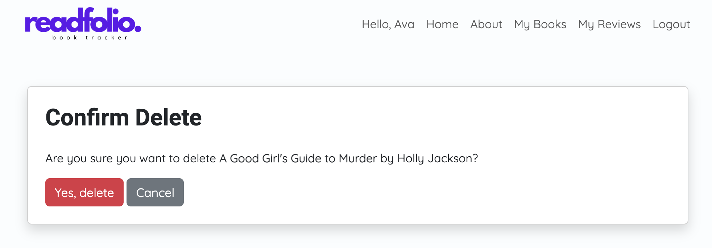

### Reviews (CRUD)

- Write reviews only for books marked "Finished" (see photo above)
- Mark reviews as **public** (homepage) or **private** (user-only)  
- Edit or delete reviews  
- Homepage displays rotating public reviews  

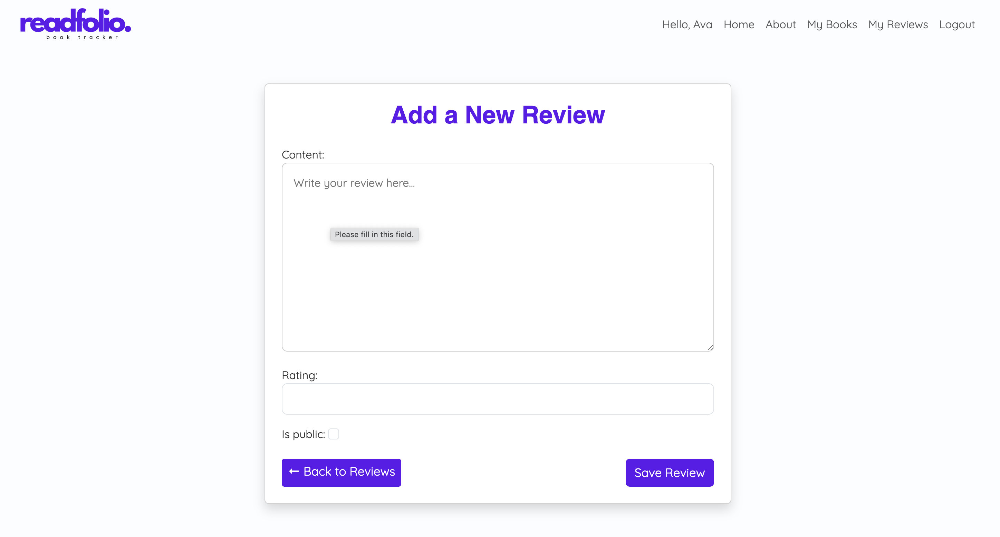
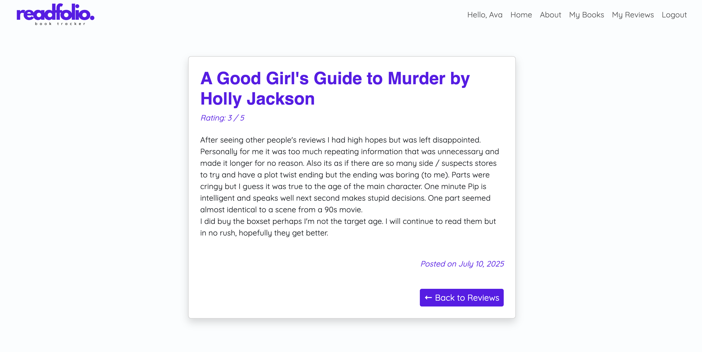
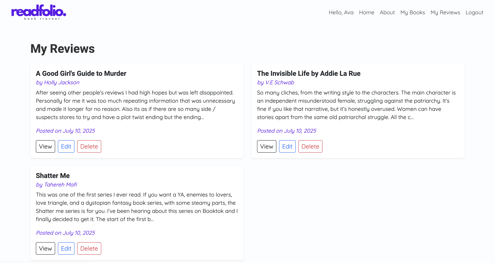

### Authentication & Authorization

- Sign-up/login via `django-allauth`  
- Register with full name, email, and password  
- User’s name shown in navbar post-login  
- Authenticated users can only access their own content  
- Navbar changes based on login status  

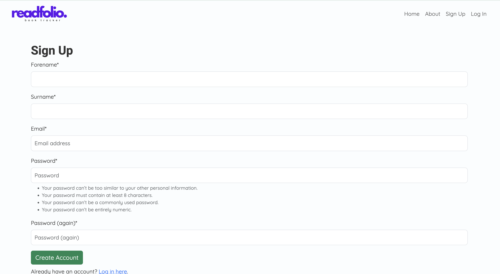
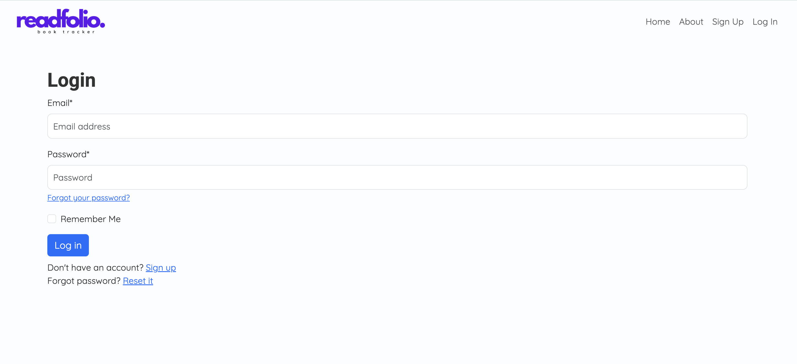
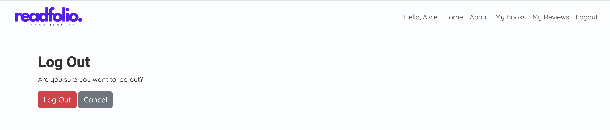

### Feedback and Validation

- Bootstrap alerts confirm success/errors  
- Review form includes validation and `is_public` checkbox  

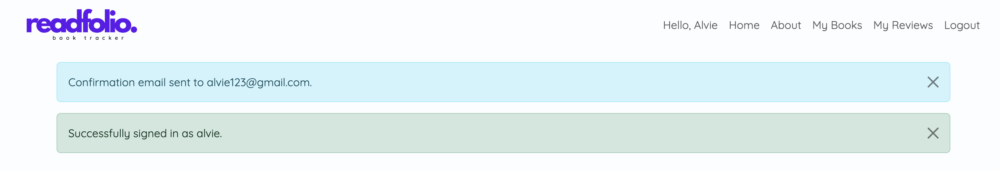
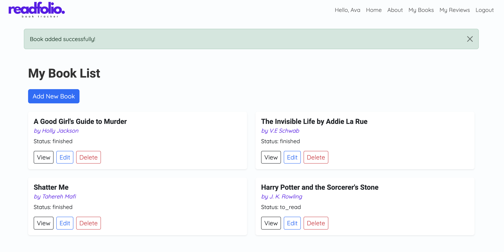

---

## How It Works

1. **User Registers** via `django-allauth`  
2. **Login** with email/password updates navbar  
3. **Track Books** by status (To Read → Reading → Finished)  
4. **Write Review** only after a book is marked "Finished"  
5. **Choose Privacy** for each review  
6. **Homepage Shows** random public reviews  
7. **Access Control** enforced for user-specific content  

---

## Technology Stack

- **Framework**: Django 5 (MVC)  
- **Language**: Python 3  
- **Frontend**: Bootstrap 5.3, HTML5, CSS3, Django Templating  
- **Database**: PostgreSQL (production), SQLite (development)  
- **Authentication**: `django-allauth`  
- **Static File Handling**: Whitenoise  
- **Hosting**: Heroku  
- **Version Control**: Git + GitHub  

---

## Files and Structure

- `readfolio/` – Project-level configuration  
- `books/` – Book app (models, views, templates)  
- `reviews/` – Review app  
- `templates/` – Base layout and partials  
- `static/` – Custom CSS, favicon, JS  
- `requirements.txt` – Dependencies  
- `Procfile` – Heroku deployment file  
- `.env` – Local variables (excluded from Git)  

---

## Models:

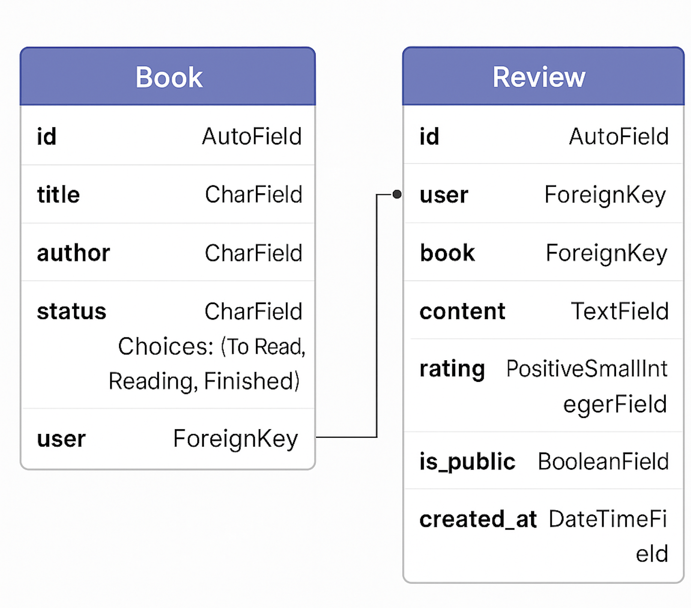

---

## Testing

### Overview

Testing combines automated unit tests and manual verification to ensure functionality, access control, form validation, and responsiveness.

### Automated Tests

**Located in**: `books/tests.py`

#### Model Tests

- `test_string_representation` – Confirms correct `__str__` for books  
- `test_book_creation` – Ensures books are created with user and status  
- `test_review_string` – Verifies review string includes related book  

#### View Tests

- `test_redirect_if_not_logged_in` – Prevents anonymous access  
- `test_logged_in_user_can_see_books` – Confirms user-specific visibility  
- `test_create_book_view` – Simulates book form submission  

#### Form Tests

- `test_invalid_review_missing_rating` – Confirms validation error on empty form  
- `test_valid_review_submission` – Ensures valid review is saved  

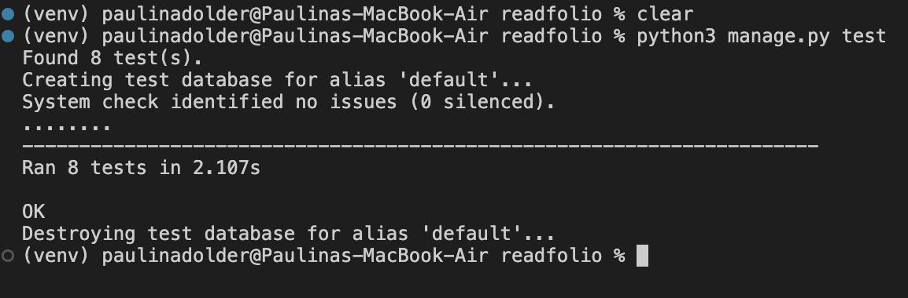

### Manual Testing

- Book and review CRUD tested in both logged-in and logged-out states  
- Confirmed access control and feedback messages  
- Verified redirect behavior on unauthorized actions  

### Responsiveness

- Tested via Chrome DevTools:  
  - Navbar collapses  
  - Forms/cards scale correctly  
  - No layout overflows  

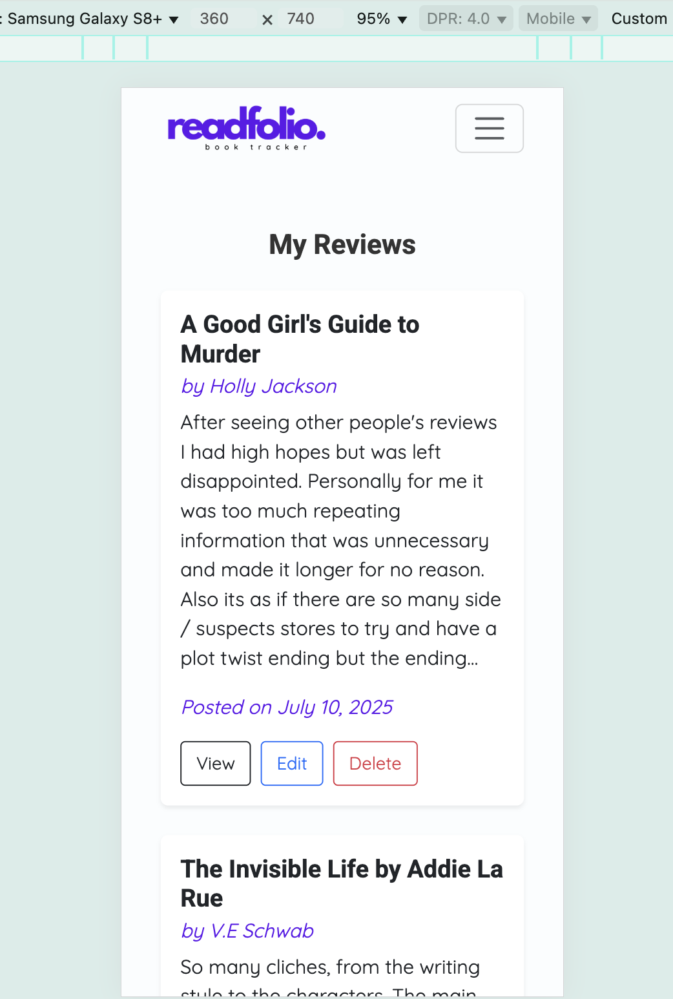
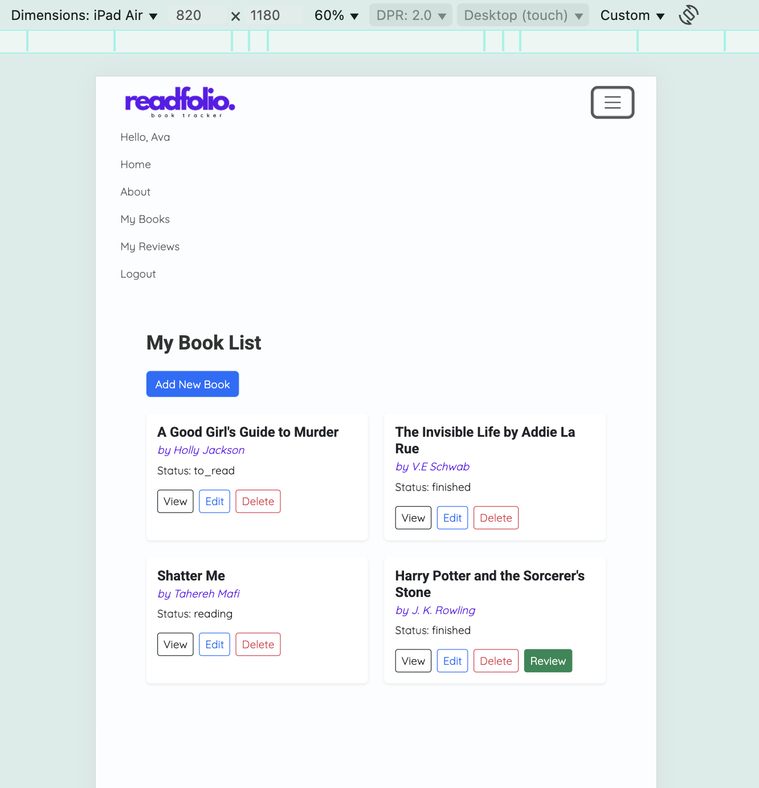

---
### Lighthouse Audits

| Category      | Score |
|---------------|-------|
| Accessibility | 98    |
| Performance   | 90    |
| SEO           | 91    |
| Best Practices| 100   |

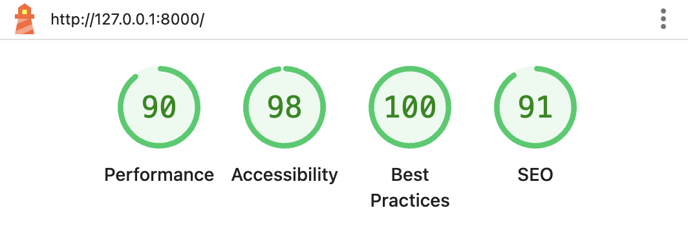

### Additional Tests

- **Functionality**: Register/login/logout, CRUD, toggle review privacy  
- **Cross-Browser**: Chrome, Firefox, Safari tested via Lambda Test  
- **Error Handling**: 403/404 tested by attempting blocked routes  
- **Validation**:  
  - HTML – W3C Validator  - there was errors displayed only relevant to the DTL (DJango Template Languagr) that was used throughout the project with no real HTML errors = success!
  - CSS – W3C CSS Validator   

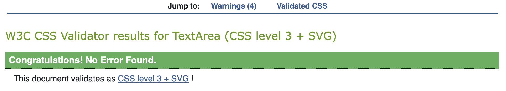

---

## Deployment

### Hosting Platform

Heroku (PostgreSQL + Whitenoise)

### Deployment Steps

1. Create GitHub repo  
2. Create Heroku app  
3. Add config vars (`SECRET_KEY`, `DEBUG`, etc.)  
4. Add PostgreSQL add-on  
5. Run `collectstatic`, `migrate`  
6. Push: `git push heroku main`  
7. App accessible via Heroku URL  

### Repo Hygiene

- No unused code or comments  
- Clear and descriptive commit messages  

### Security Measures

- `.env` used for all sensitive variables  
- Excluded from Git  
- `DEBUG=False` in production  
- Whitenoise handles static files  

### Future Plans

- Add sorting/filtering to review and book dashboard  e.g. sort books by reading status
- Connect actual email API for password resets and confirmations
- Remove unused folders (`/static/js/`)  
- Address minor performance suggestions  

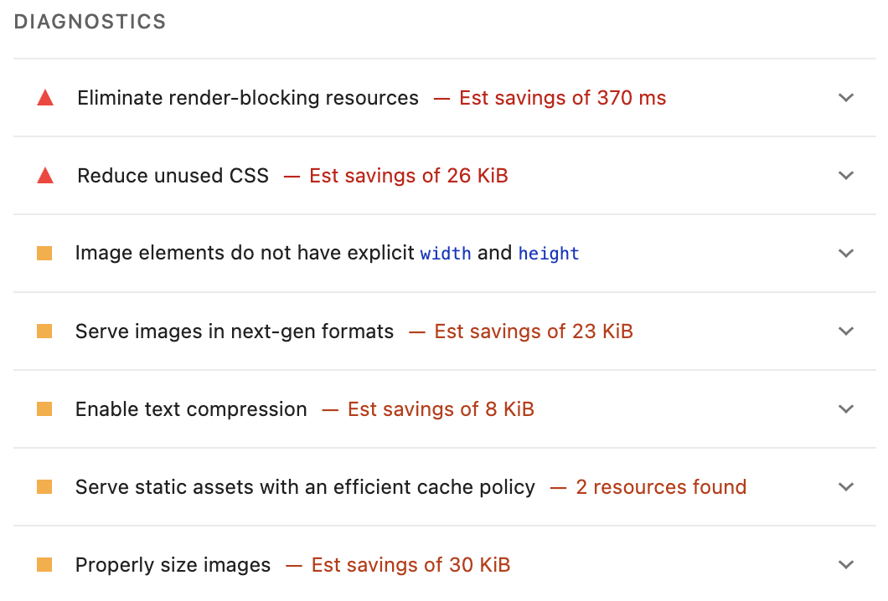

---

## Credits

- **Idea**: Frustration with noisy book-tracking platforms  
- **Logo**: Designed in Canva  
- **Fonts**: Google Fonts (Quicksand, Roboto)  
- **Images**: Pexels (free image)  
- **Framework**: Bootstrap  
- **Icons/Favicon**: favicon.io  
- **Agile Planning**: GitHub Projects  
- **Deployment**: Heroku with Code Institute guidance  
- **Dummy Reviews**: Public sources + original content  

---

## Contact

Have suggestions or questions?

**Email**: [paulid4628@gmail.com](mailto:paulid4628@gmail.com)  
**GitHub**: [ReadFolio Repo](https://github.com/PaulinaD-CodeIns/readfolio)  
**Live Site**: [ReadFolio on Heroku](https://readfolio-1c0fe0bd7ac4.herokuapp.com/)
